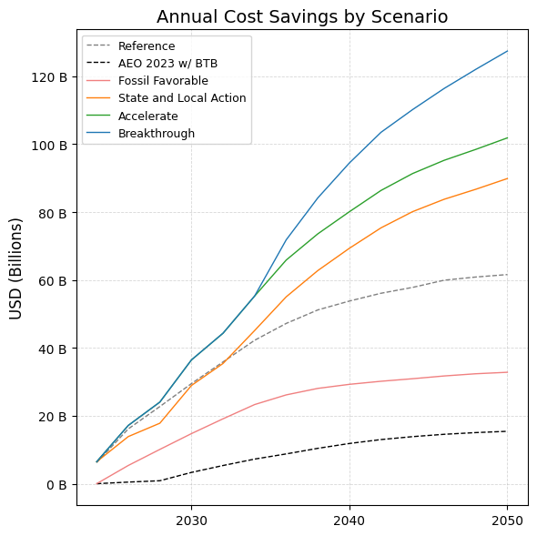
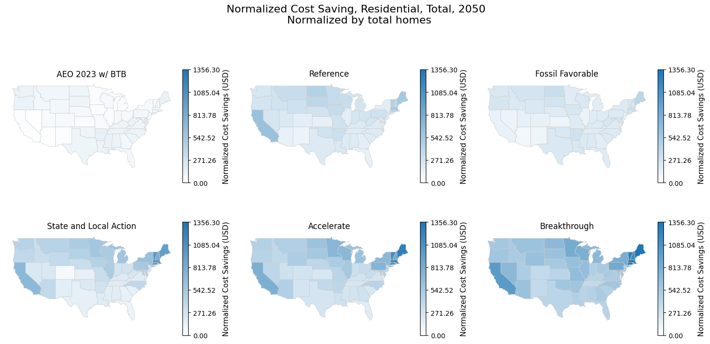
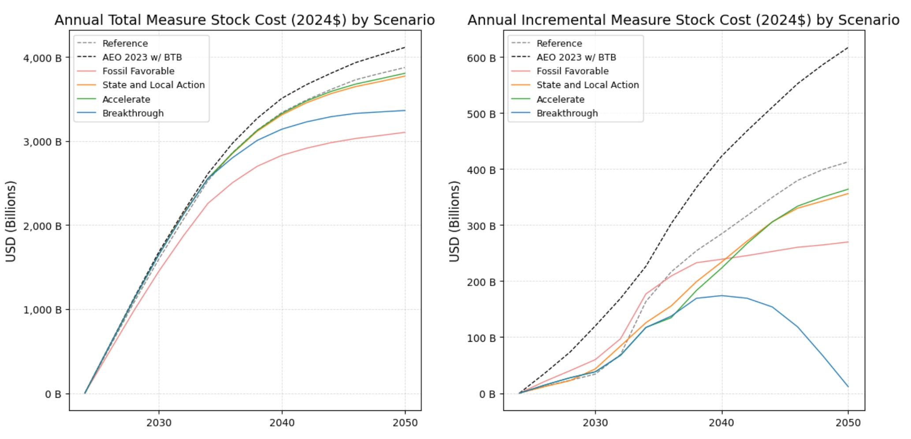
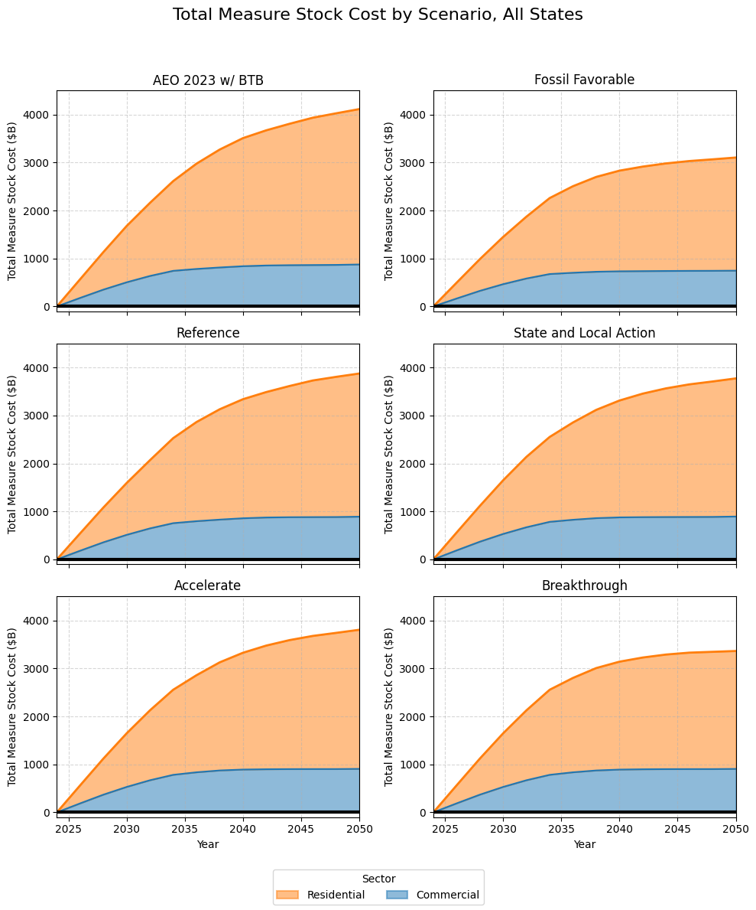

# Cost Analysis from Scout Results

This guide outlines the steps to generate operational cost and capital cost analysis tables (.csv) and visualizations from Scout outputs.

---

## Step 1: Prepare Input Data

- Download the latest **Scout results** into the `scout_results/` directory.
- Place them in a subfolder named by date in the format `mmddyy` (e.g., `062725`).
- Example file names: `aeo.json`, `ref.json`, `state.json` etc. 
---

## Step 2: Generate Cost Tables

### Operational Cost Table 
Extracts:
- Efficient Energy Cost (USD)
- Baseline Energy Cost (USD)
- Energy Cost Savings (USD)
Saved in: `cost_table/`

Run the following command from the terminal:
```bash
python bss_workflow_cost.py --gen_scoutdata_cost --folder mmddyy
```

- Converts JSON data in `scout_results/mmddyy/` into CSV files.
- Output files saved to `cost_table_operational/`
- Example output: `cost_table_operational/aeo.csv`, `cost_table_operational/ref.csv`, etc.
- Depending on the size of the JSON file, each conversion takes approximately 1–2 minutes. In testing, converting six scenario files took around 7–8 minutes.

### Annual Capital Cost Table 
Extracts:
- Total Measure Stock Cost (2024$)
- Incremental Measure Stock Cost (2024$)
Saved in: `cost_table_capital/`

Run the following command from the terminal:
```bash
python bss_workflow_cost.py --gen_scoutdata_annual_capital_cost --folder mmddyy
```
- Converts capital expenditure data to annual CAPX tables.
- Output files saved to `cost_table_capital/`
- Example output: `cost_table_capital/aeo_annual_CAPX.csv`, etc.

---

## Step 3: Visualize Results in Jupyter Notebook
There are two separate notebooks for analyzing the operational and capital cost. The output graphs are generated in the corresponding folder `cost_graph_operational` or `cost_graph_capital`.

### Operational Cost Analysis
Generates plots related to maintenance and operational costs, aggregated at the state or national level.

Open `operational cost analysis.ipynb` and run the cells to generate the following plots:

#### Annual-Level Plots
- Total annual cost by scenario
- Annual cost savings by scenario


#### Normalized Sector-End Use Cost (for a selected year, default: **2050**)
- **Commercial**: normalized by square footage
- **Residential**: normalized by number of homes


#### State-Specific Stack Plot
- Shows incremental years (default: **2030**, **2040**, **2050**)


### Capital Cost Analysis
Generates plots related to capital expenditure (CAPX) at the national level. 
Open `capital cost analysis.ipynb` and run the cells to generate the following plots:

#### Annual-Level Capital Investment (2024-2050)
- Total measure stock cost (2024$)
- Incremental measure stock cost (2024$)


#### Annual-Level Capital Investment break down by Residential and Commercial Sector (2024-2050)
- Side-by-side comparison of CAPX trends across scenarios


#### Stack Plot
- Shows incremental years (default: **2030**, **2040**, **2050**)


---

## Notes
- Ensure all required CSVs are present in `cost_table_for_viz/` before running the notebook.
- State, Sector (Residential, Commercial), End use (heating, cooling) and target year can be adjusted within the notebook.
